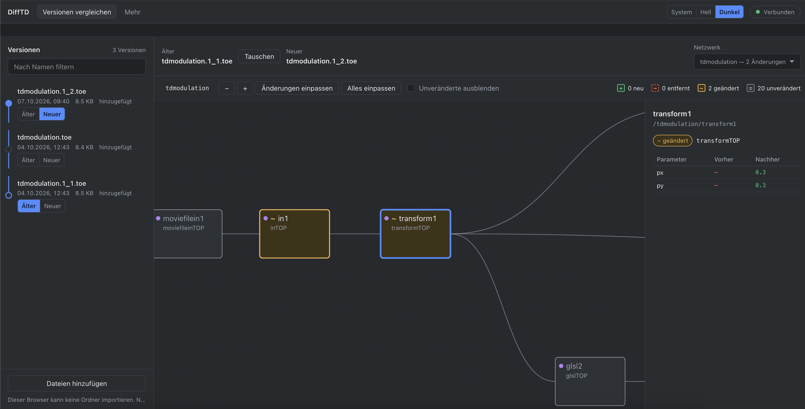

# DiffTD – version control for TouchDesigner

## Overview

`.toe` and `.tox` files are binary, so Git cannot show what changed between two saved versions of a TouchDesigner project, and comparing versions by hand means opening each one in its own TouchDesigner instance. DiffTD reads the saved files directly and shows the difference as the network itself: nodes where they sit in the TouchDesigner editor, with added, removed and changed nodes marked. TouchDesigner does not have to be running.


*Two versions of a project side by side: the newly added node is marked in the network, everything else is unchanged. The version list on the left is a timeline; Older and Newer pick the pair to compare.*



*Select a node to see exactly what changed in it: parameter values before and after, and for script and table nodes the changed lines and cells. Screenshots show the dark appearance and the German interface; the page follows your browser language and has a switch for system, light and dark appearance.*

## Quick start: compare saved versions of a project (no TouchDesigner running)

```sh
python3 -m difftd serve --open
```

The page opens (German or English, following your browser). Bring your saved versions in:

- **Import folder** – pick the folder with your `.toe`/`.tox` versions (Chromium-based browsers). **Refresh** picks up new saves; the next visit offers to re-open the folder.
- **Add files** – or drag files onto the page. Works in every browser; identical content is listed once.

Then choose **Older** and **Newer** on the version rail (or **Swap**). You see the network as it looks in TouchDesigner (real positions); added, removed and changed nodes are marked with glyphs and outlines, a click shows old/new parameter values and changed script lines or table cells, moved nodes are noted but not counted as changes, and **Fit changes** zooms to what changed. The header has an appearance switch (System, Light, Dark); your choice is remembered in the browser, "System" follows the computer's setting live.

Nothing leaves your computer: the page talks only to the small helper on `localhost`, which uses TouchDesigner's own `toeexpand` (installed with TouchDesigner, found automatically; override with `DIFFTD_TOEEXPAND`) and keeps nothing after converting. TouchDesigner itself does not need to run. If the helper is not running, the page shows the command to start it.

`python3 -m difftd serve "/path/to/folder"` still works and lists that folder's versions in the same list. `python3 -m difftd convert MyProject_v2.toe -o v2.json` writes a snapshot for **More → Two snapshot files**. Details: `specs/002-toe-version-compare/`, `specs/003-import-versions-ui/`.

The rest of this document describes the Git-based workflow (snapshots on every save, hooks, merge review).

`.toe` / `.tox` files are binary: Git cannot diff or merge them. DiffTD turns a TouchDesigner network into deterministic JSON snapshots, shows changes visually, and rebuilds the network from those snapshots.

```
 TouchDesigner ──save──▶ Export ──▶ snapshots/*.json ──▶ Git ──▶ opdiff (diff / merge review)
        ▲                                                  │
        └──────────── Reload ◀── Import ◀── Git hooks ◀────┘
```

| Part | Where | What it does |
|------|-------|--------------|
| Read `.toe`/`.tox` | `difftd/toe.py`, `difftd/server.py`, `difftd/cli.py` | Converts saved project files via `toeexpand` for the viewer's "My .toe versions" mode |
| Export | `difftd/exporter.py`, `difftd/td/execute_callbacks.py` | On every project save (and on demand) writes one snapshot per top-level COMP |
| Import / Reload | `difftd/importer.py`, `difftd/reload.py`, `difftd/api.py` | Rebuilds COMPs from snapshots; backs up unsaved edits first |
| Git hooks | `hooks/` | `post-checkout`, `post-merge`, `post-rewrite` tell the running project to reload |
| opdiff | `viewer/` | Browser app: visual diff of two files or two commits, and a 3-way merge review |
| Schema | `schema/snapshot.schema.json` | The one snapshot format used by all of the above |

Design documents: `specs/001-td-version-control/` (spec, plan, research, data model, contracts, tasks). Governing principles: `.specify/memory/constitution.md`.

## Snapshot files

`snapshots/<project>/<topLevelComp>.json`, canonical JSON (sorted keys, 2 spaces, LF). Re-exporting an unchanged network produces identical bytes; changing one parameter changes one line. They contain, per node: path, type, **all** parameters with values (including defaults; expressions and binds are kept), the content of text and table DATs, plus the connections inside the COMP. No timestamps.

## Install in TouchDesigner

1. Keep the project (`.toe`) inside a Git repository; the repository root is the folder containing the `.toe`.
2. Build `DiffTD.tox` following `td/README.md` and add it to the project container (default `/project1`). It puts this repository's `difftd/` package on the Python path, runs an Execute DAT (`onProjectPostSave`) and a Web Server DAT bound to `127.0.0.1:9980`.
   *Status: the Python package is complete and tested outside TouchDesigner; the `.tox` wrapper and the first run inside TouchDesigner still have to be done — see the open tasks in `specs/001-td-version-control/tasks.md`.*
3. Run `difftd/td/probe.py` once inside TouchDesigner. It checks every TouchDesigner API call DiffTD relies on and prints OK/FAIL per item.
4. Install the Git hooks: `sh hooks/install.sh /path/to/project-repo` (existing hooks are kept; `--uninstall` removes only DiffTD's block). Requires `git` and `curl`.
5. Optional `difftd.config.json` in the repository root: see `specs/001-td-version-control/contracts/config.md`.

## Use the viewer (opdiff)

```sh
python3 -m http.server 8080      # from this repository's root
```

Open `http://localhost:8080/viewer/`.

- **Compare versions** (needs `python3 -m difftd serve`, see the quick start above).
- **More → Two snapshot files**: pick a before and an after snapshot (any browser).
- **More → Git history**: pick the project folder, then any two commits and a container (Chromium-based browsers; the viewer reads the folder locally, nothing is uploaded).
- **More → Merge review**: during or before a merge, shows only real conflicts (same parameter changed differently, node edited vs deleted, overlapping DAT lines), lets you choose per conflict, then **Write merged result** (explicit) and **Reload in TouchDesigner** (explicit). Edits to different parameters of the same node merge automatically.

## Tests

```sh
pip install pytest jsonschema && npm install
pytest                        # Python: snapshot, exporter, importer, reload, HTTP API, whole loop
npm test                      # JavaScript: schema, serialization (byte-equal with Python), diff, layout, merge, git access
sh tests/hooks/run.sh         # Git hooks against a stub server
python3 tests/fixtures/generate.py   # regenerate fixtures after a format change
```

## Limitations (v1)

- Node positions are read from `.toe` files (display only); the live TouchDesigner exporter does not write them yet. A renamed node shows as removed plus added.
- COMP-to-COMP (top) connections and parameter exports are not restored on import (exports are recorded but only informational).
- Reloading rebuilds a top-level COMP completely; unsaved edits in it are saved to `.difftd/backups/` first.
- Commit and merge modes of the viewer need a Chromium-based browser.
- The reload endpoint listens on localhost only and accepts file names inside `snapshotDir`, never file contents.

## License

MIT, see `LICENSE`. Use it, copy it, change it, fork it, ship it, in any project and for any purpose. The only requirement is to keep the copyright and license notice with copies. Licenses of the third-party code in the viewer's bundle are in `viewer/vendor/THIRD-PARTY-NOTICES.md`.
